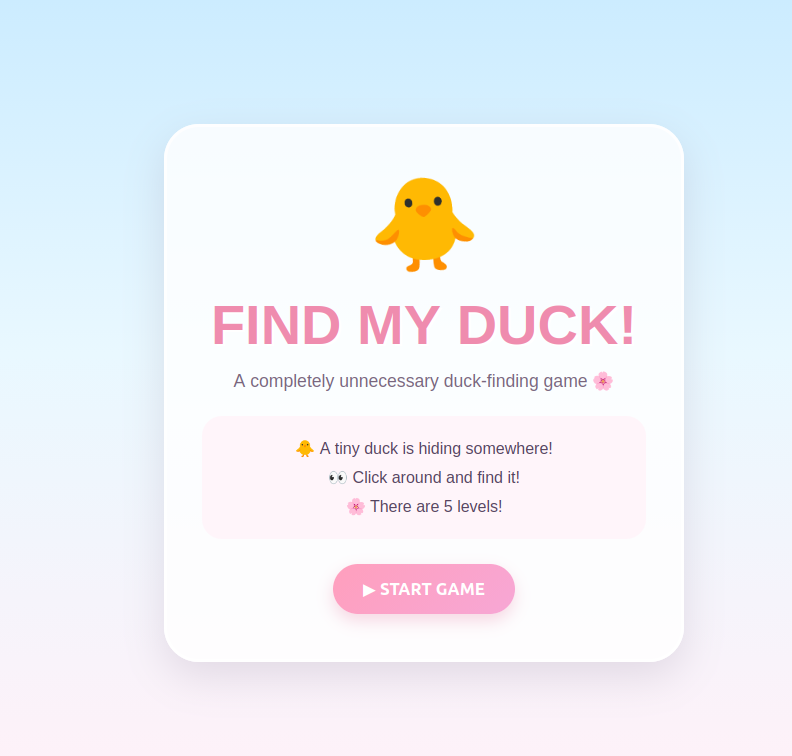
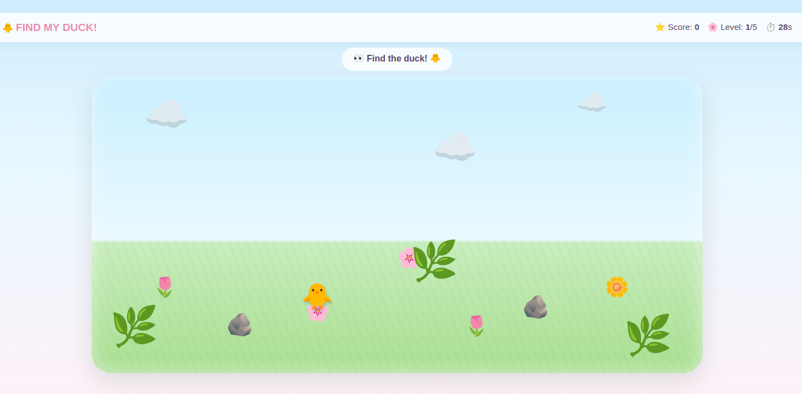
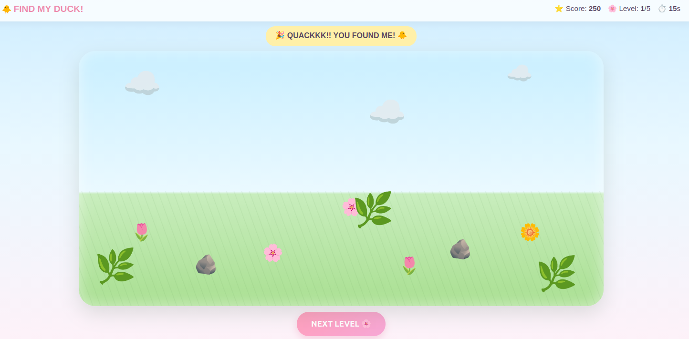

# [Project Name] 🎯

## Basic Details
### Team Name: FT.DEAN

### Team Members
- Team Lead: Ananya Rajeev - ICCS College of Engineering and Management
- Member 2: Devapadhmaa V K - ICCS College of Engineering and Management
  
### Project Description
Find My Duck! is an overly dramatic web-based duck-hunting game where the player must hunt down a hidden duck across progressive levels. The ultimate twist occurs in Level 5 when the duck gains sentient evasive behavior and aggressively flees from your mouse cursor for 7 seconds before collapsing from exhaustion.

### The Problem (that doesn't exist)
In a world oversaturated with productivity tools and complex video games, humans suffer from a severe deficiency of chasing uncooperative waterfowl across a pastel virtual field. Traditional digital ducks sit passively waiting to be clicked, completely failing to simulate the true stress of trying to grab an elusive animal.

### The Solution (that nobody asked for)
We built an interactive, browser-based duck-chasing simulator. It misleads the player through four peaceful levels of hidden-object gameplay before initiating an unprovoked boss-fight sequence where the duck actively calculates proximity vectors to run away from the cursor while throwing hilarious dynamic taunts at the user.

## Technical Details
### Technologies/Components Used
For Software:
- Languages used: HTML5, CSS3, JavaScript (ES6+)
- Frameworks used: None (Vanilla JS for maximum browser compatibility)
- Libraries used: Native Web APIs (DOM Manipulation, Math API)
- Tools used: VS Code, Git, Browser Developer Tools

For Hardware:
- Software-only project
 
### Implementation
For Software:
# Installation
[commands]

# Run
open index.html
python3 -m http.server 8000

### Project Documentation
For Software:

# Screenshots (Add at least 3)

The welcome landing card for "FIND MY DUCK!", displaying game rules, instructions, an animated duck icon, and the "START GAME" button.

Active Level 1 gameplay showing the game area filled with environment decorations (flowers, rocks, bushes) where the duck is currently hiding near a pink flower.

Win state after successfully clicking the duck, displaying the updated score, celebratory message ("QUACKKK!! YOU FOUND ME!"), and revealing the "NEXT LEVEL" button.

### Project Demo
# Video
demovideo.webm
Levels 1 to 4:** Standard point-and-click hidden object mechanics where the player quickly locates and clicks the duck placed around flowers, rocks, and clouds.
**Level 5 Twist:** The duck dynamically dodges the cursor whenever it gets close, continuously repositioning around the screen while displaying funny messages ("Keep chasing!", "Fast duck energy!", "Nice try!", "Too slow!").
* **Completion State:** After the chase phase, the duck gets tired, moves to the center, and allows the final click to trigger the "YOU DID IT!" victory screen with a final score of 1530 points.

# Additional Demos
Nil

## Team Contributions
- Ananya Rajeev: UI/UX visual styling, CSS animations, responsive layout design, and game audio/message triggers.
- Devapadhmaa V K: Game architecture design, DOM state logic, Level 5 mouse proximity escape calculations, and project documentation.

---
Made with ❤️ at TinkerHub Useless Projects 

